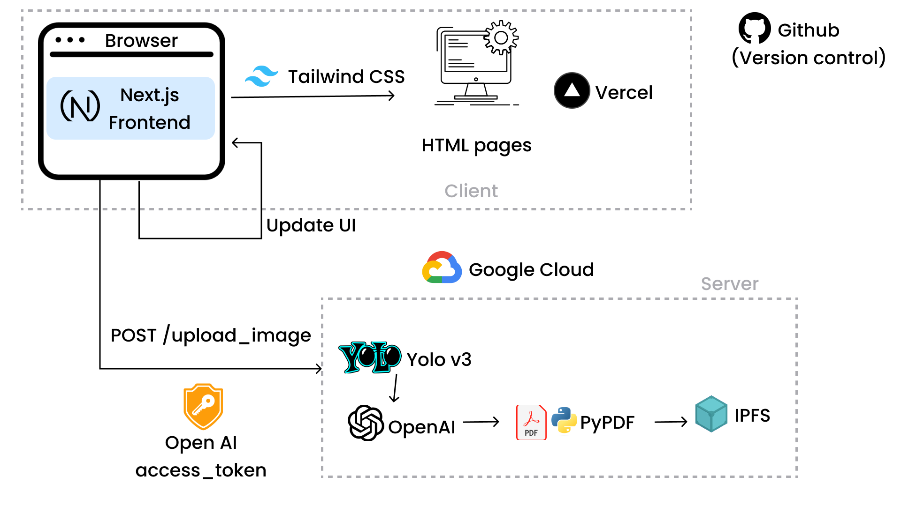

# Submitted to Hack The 6ix 2023

# A Comprehensive Guide on VisionCraft [](https://github.com/angeladev333/hack-the-6ix)

> VisionCraft is a new way to capture and analyze your hardware setup, unlocking a wealth of possibilities

## Project Statistics

<p align="center">
    <a href="https://github.com/simple-icons/simple-icons/actions?query=workflow%3AVerify+branch%3Adevelop">
        
    </a>
    <a href="https://hits.dwyl.com/angeladev333/hack-the-6ix">
        
    </a>
</p>

<p align="center">
    <a href="https://www.npmjs.com/package/simple-icons"></a>
    <a href="https://github.com/{owner}/{repo}/pulls">
    
    </a>
    <a href="https://github.com/{owner}/{repo}/commits">
     
<br/><br/>
    
                
</a>

</p>

## Deployment

Since VisionCraft is a non-static full-stack application, we used [Vercel](https://vercel.com/) to ship the deployment. Github Actions was used in the process.

[View](https://hack-the-6ix-git-master-angeladev333.vercel.app/) deployment at https://hack-the-6ix-git-master-angeladev333.vercel.app/.

## Usage

When an 'upload_image' api request is initiated, the image gets uploaded to the Roboflow API for YOLO Object detection. Then, the user-inputted form data consolidated with the object detection data is forwarded to a sequence of ChatGPT and DALL-E image prompts. The content generated from these processes is then combined to produce a comprehensive guide in PDF format.

## Tech stack and program architecture



### Project Story

## 🌍 Inspiration Behind visioncraft.ai 🚀
When staring at the increasing heaps of discarded gadgets and electronics, a question invariably arose in our minds: "Can we make a difference here?" 🤔❓

Introducing... the tech waste dilemma. It's no secret that our world is swamped with discarded tech. These devices, once marvels of their time, now contribute to an ever-growing environmental concern. We produce 40 million tons of electronic waste every year, worldwide. That's like throwing 800 laptops away every second. 🌏💔

Instead of seeing these gadgets as waste, we started seeing potential. The idea: leverage the power of deep learning to infuse old tech with new life. This wasn't about recycling; it was about reimagining. 🔄🔍

We believed that there was a way to reduce this waste by allowing users to reuse their spare electronic parts to create Arduino projects. Through visioncraft.ai, we are confident that we can encourage the pillars of reducing, reusing, and recycling, solving an ever-evolving problem in the world around us. 💡✨

## 🚀 What visioncraft.ai does 🛠️
The user starts on a landing page where they can view the functionalities of our product demo. By clicking the "Get Started" button, they are directed to a form where they can fill out some basic information. Here, they are prompted for their idea, the materials they already have, their budget, and an option to upload a photo of the materials. Once done, they hit the submit button, and the magic of tutorial generation begins!💡💸

Immediately after, a POST request is sent to the server, where the image is dissected using a deep learning model hosted on Roboflow, ensuring any electronic parts are detected. Then, the idea, budget, and identified parts (including those manually entered by the user) get fed into OpenAI's GPT-35-turbo and DALLE-2 APIs for deeper magic. Through cleverly crafted prompts, these engines whip up the body text and images for the tutorial. Once all the data is ready, it's transformed into a neat PDF 📄 using the Python fPDF library. And voilà! A new tab pops up, delivering the PDF to the user, all powered by the decentralized IPFS file systems 🌐📤.

## 🤖 How we built visioncraft.ai 🎨
First, we used Figma to visualize our design and create a prototype for how we envisioned our website. To actually build the front-end, we used Next.js and Tailwind CSS for styling. We incorporated features like the Typewriter effect and fade animations for the cards to create a minimalist and modern aesthetic. Then, we used Vercel to ship the deployment given it's a non-static full-stack application 🖥️🌌.

The backend is powered by Python, with a Flask application serving as the base of our app . A deep learning model was accessed, modified, and hosted on Roboflow.com, and we call an API on the image taken by the individual to identify individual parts and return a list in JSON. The list is scraped and combined with the manually entered list, and duplicates are removed. DALLE-2 and GPT-35-Turbo were used to generate the text and images for the tutorial using engineered prompts, and using the fPDF/PyPDF2 libraries, we were able to format the PDF for user accessibility. The generated PDF was uploaded to Interplanetary File Storage (IPFS) via the NFTPort.XYZ via an API, and a link is returned to the front-end to be opened in a new tab for the user to see 📜🌐.

To integrate the front-end and the back-end, the redirects feature provided by next.js in the next.config.js feature was used so that the server API was accessible by the client. Here is a link for reference: https://nextjs.org/docs/pages/api-reference/next-config-js/redirects 🔄📗.

One problem that was encountered during this integration was the default proxy time limit of Next.js, which was too short for our server call. Luckily, there was an experimental property named 'proxyTimeout' that could be adjusted to avoid time-out errors ⏳🛠️.

## 🚧 Challenges on the Road to visioncraft.ai 🌪️
Diving into the world of tech innovation often comes with its set of challenges. Our journey to create VisionCraft.ai was no exception, and here's a snapshot of the hurdles of our journey. 🛤️🔍

### 🌩️ Cloudy Days with Flask and Google Cloud ☁️
When we started with our Flask backend, hosting it on Google Cloud seemed like the perfect idea. But alas, it wasn't a walk in the park. The numerous intricacies and nuances of deploying a Flask application on Google Cloud led to two sleepless nights, Yet, each challenge only solidified our resolve and, in the process, made us experts in cloud deployment nuances as we used App Engine to deploy our back-end. 💪🌪️

### 📜 Typewriter: Bringing Life to the Front-end 🎭
Web apps can't just be functional; they need to be dynamic and engaging! And that's where Typewriter stepped in. By leveraging its capabilities, our front-end wasn't just a static display but a lively, interactive canvas that responded and engaged with the user. 🖥️💃

### 🔄 Bridging Two Worlds: Vercel and Google Cloud 🌉
Our choice of hosting the front end on Vercel while having the back-end on Google Cloud was, to some, unconventional. Yet, it was essential for our vision of having a hosted website. The challenge? Ensuring seamless integration. With a slew of API calls, endpoints tweaking, and consistent testing, we built a bridge between the two, ensuring that the user experience remained smooth and responsive. However, it was most definitely not easy, since we had to figure out how to work with generated files without ever saving them. 🌐🤖

## 🏆 Our Proud Accomplishments with visioncraft.ai 🎉
Embarking on the journey of creating visionxraft.ai has been nothing short of transformative. Along the way, we faced challenges, celebrated victories, and took leaps into the unknown. Here's a glimpse of the milestones that fill us with pride. 🌟🛤️

### 🧠 Embracing YOLO for Deep Learning 🎯
We wanted visioncraft.ai to stand out, and what better way than by integrating state-of-the-art object detection? Implementing deep learning through YOLO (You Only Look Once) detection was ambitious, but we dove right in! The result? Swift and accurate object detection, paving the way for our app to recognize and repurpose tech waste effectively. Every detected item stands as a testament to our commitment to precision. 🔍✨

### 🖥️ Venturing into the World of Next.js 🚀
Taking on Next.js was a first for us. But who said firsts were easy (they're not, source: trust us lol)? Navigating its features and capabilities was like deciphering an intricate puzzle. But piece by piece, the picture became clearer. The result was a robust, efficient, and dynamic front-end, tailored to provide an unparalleled user experience. With every click and interaction on our platform, we're reminded of our bold plunge into Next.js and how it paid off. 💡🌐

### 📄 Perfecting PDFs with PyPDF2 📁
Documentation matters, and we wanted ours to be impeccable. Enter PyPDF2! Utilizing its capabilities, we were able to craft, format, and output PDF files with finesse. The satisfaction of seeing a perfectly formatted PDF, ready for our users, was unmatched. It wasn't just about providing information but doing it with elegance and clarity. 🌟📜

## 📚 Key Learnings from Crafting visioncraft.ai 🌟
While building visioncraft.ai, our journey wasn't solely about developing an application. It was a profound learning experience, encompassing technical nuances, deep learning intricacies, and design philosophies. Here's a peek into our treasure trove of knowledge gained. 🛤️🔎

### 🌐 Hosting Across Platforms: Google Cloud & Vercel 🚀
Navigating the hosting landscape was both a challenge and an enlightening journey:

- Flask on Google Cloud: Deploying our Flask backend on Google Cloud introduced us to the multifaceted world of cloud infrastructure. From understanding VM instances to managing security protocols, our cloud expertise expanded exponentially. ☁️🔧
- Next.js on Vercel: Hosting our Next.js front-end on Vercel was a dive into serverless architecture. We learned about efficient scaling, seamless deployments, and ensuring low-latency access for users globally. 🌍🖥️

### 🧠 Delving Deep into Deep Learning and YOLO3 🤖
Our venture into the realm of deep learning was both deep and enlightening:

- Training Models: The art and science of training deep learning models unraveled before us. From data preprocessing to tweaking hyperparameters, we delved into the nuances of ensuring optimal model performance. 📊🔄
- YOLO3 Functionality: YOLO3 (You Only Look Once v3) opened up a world of real-time object detection. We learned about its unique architecture, how it processes images in one pass, and its efficiency in pinpointing objects with precision. 🔍🎯

### 🎨 Crafting Engaging Web Experiences 🌈
Designing visioncraft.ai was more than just putting pixels on a screen:

- User-Centric Design: We realized that effective design starts with understanding user needs. This led us to prioritize user journeys, ensuring each design choice enhanced the user experience. 🤝🖌️
- Interactive Elements: Making our website interactive wasn't just about adding flashy elements. We learned the subtle art of balancing engagement with functionality, ensuring each interaction added value. 💡🕹️
- Consistency is Key: An engaging website isn't just about standout elements but ensuring a cohesive design language. From typography to color palettes, maintaining consistency was a lesson we'll carry forward. 🎨🔗

## 🌟 The Road Ahead for visioncraft.ai 🛣️
visioncraft.ai's journey so far has been incredibly enriching, but it's just the beginning. The world of tech is vast, and our mission to reduce tech waste is ever-evolving. Here's a glimpse into the exciting developments and plans we have in store for the future. 🚀🔮

### 🌐 Expanding our Cloud Capabilities ☁️
We're diving deeper into cloud integrations, exploring newer, more efficient ways to scale and optimize our application. This will ensure a faster, more reliable experience for our users, no matter where they are on the globe. 🌍💡

### 🤖 Advanced AI Integrations 🧠
While YOLO has served us well, the realm of deep learning is vast:

- Enriched Object Detection: We're looking into further refinements in our AI models, allowing for even more precise object recognition. 🔍🎯
- Personalized Recommendations: Using AI, we aim to offer users personalized suggestions for tech waste reduction based on their unique usage patterns. 📊👤

### 🎨 Elevating User Experience 🖌️
Design will always remain at the heart of visioncraft.ai:

- Mobile-First Approach: With increasing mobile users, we're focusing on optimizing our platform for mobile devices, ensuring a seamless experience across all devices. 📱✨
- Interactive Guides: To help users navigate the world of tech waste reduction, we're working on creating interactive guides and tutorials, making the journey engaging and informative. 📘🚀

### 🌱 Community and Collaboration 🤝
Believing in the power of community, we have plans to:

- Open Source: We're considering opening up certain aspects of our platform for the developer community. This will foster innovation and collaborative growth. 💼💡
- Workshops and Webinars: To spread awareness and knowledge, we aim to host interactive sessions, focusing on the importance of reducing tech waste and the role of AI in it. 🎤👥

The horizon is vast, and visioncraft.ai is geared up to explore uncharted territories. With passion, innovation, and a commitment to our mission, the future looks bright and promising. 🌅🌱

Join us on this exhilarating journey toward a sustainable, tech-aware future! 🌍❤️🤖

## Installation (for developers)

### Front-end

```shell
cd client
```

Install all dependencies, and next

```shell
npm i next
npm install -a
```

Run web app!

```shell
npm run dev
```

### Backend Setup and Deployment

Follow these steps to set up the backend environment and deploy your app. These instructions will guide you through creating a virtual environment, installing dependencies, and deploying to Google App Engine.

#### Step 1: Virtual Environment and Dependencies

1. Create a virtual environment and activate it:

   ```shell
   python -m venv venv
   source venv/bin/activate  # On Windows: venv\Scripts\activate
   ```

2. Install the required dependencies from `requirements.txt`:
   ```shell
   pip install -r requirements.txt
   ```

#### Step 2: Starting the Server Locally

Start the server using the following command:

```shell
python server/main.py
```

#### Step 3: Deployment to Google App Engine

Before deploying to Google App Engine, ensure you have the [gCloud CLI](https://cloud.google.com/sdk/gcloud) installed and authenticated with your Google account.

1. Install the gCloud CLI if you haven't already.

2. Authenticate with Google:

   ```shell
   gcloud auth login
   ```

3. Deploy your app to Google App Engine using:
   ```shell
   gcloud app deploy
   gcloud app browse
   ```

That's it! Your app is now deployed and accessible via the provided URL using Google App Engine.

## Third-Party Extensions

| Extension                                                                        |                                                                                      |
| :------------------------------------------------------------------------------- | :----------------------------------------------------------------------------------- |
| [Python package](https://github.com/sachinraja/simple-icons-py)                  |  |
| [React package](https://github.com/icons-pack/react-simple-icons)                |    |
| [NextUI for React](https://github.com/nextui-org/react)                          |                                                                                      |
| [React Simple Typewriter](https://www.npmjs.com/package/react-simple-typewriter) |                                                                                      |
| [YOLO 3V](https://pjreddie.com/darknet/yolo/)                                    |                                                                                      |
| [IPFS](https://ipfs.io/)                                                         |      |
